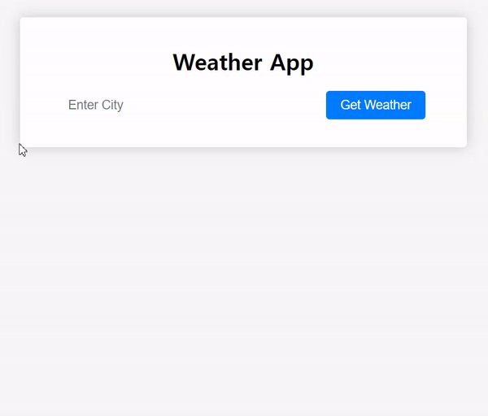

# Weather-App


## 기능  
날씨를 알려주는 사이트 

(1) 알고 싶은 도시의 이름을 입력  
(2) 해당 도시의 날씨를 출력  

## API  
https://openweathermap.org/current#name  

도시이름으로 호출하기   
- Built-in API request by city name

## 학습  
### 1. JS :  event.preventDefault()
해당 이벤트에 대한 사용자 에이전트의 기본 동작을 실행하지 않도록 지정  

```
formEl.addEventListener("submit", (event) => {
  event.preventDefault();
  const cityValue = cityInputEl.value;
  getWeatherData(cityValue);
});
```

form을 submit하면 브라우저는 새로고침하는 것이 디폴트이기 때문에 콘솔에서는 브라우저가 가진 정보가 뜨고나서 아주 빠른 순간 사라진다.  

사용자가 입력한 정보를 받아오기 위해서 새로고침을 방지할 필요가 있다. 이를 위해서 preventDefault()함수를 사용한다.  


## 학습 출처 
**유튜브**  
https://www.youtube.com/@JavaScriptKing  

**JS**  
https://developer.mozilla.org/ko/docs/Web/API/Event/preventDefault   
https://friedegg556.tistory.com/26    
https://velog.io/@lhmint93/loginform2


**키워드**  
- event.preventDefault()
